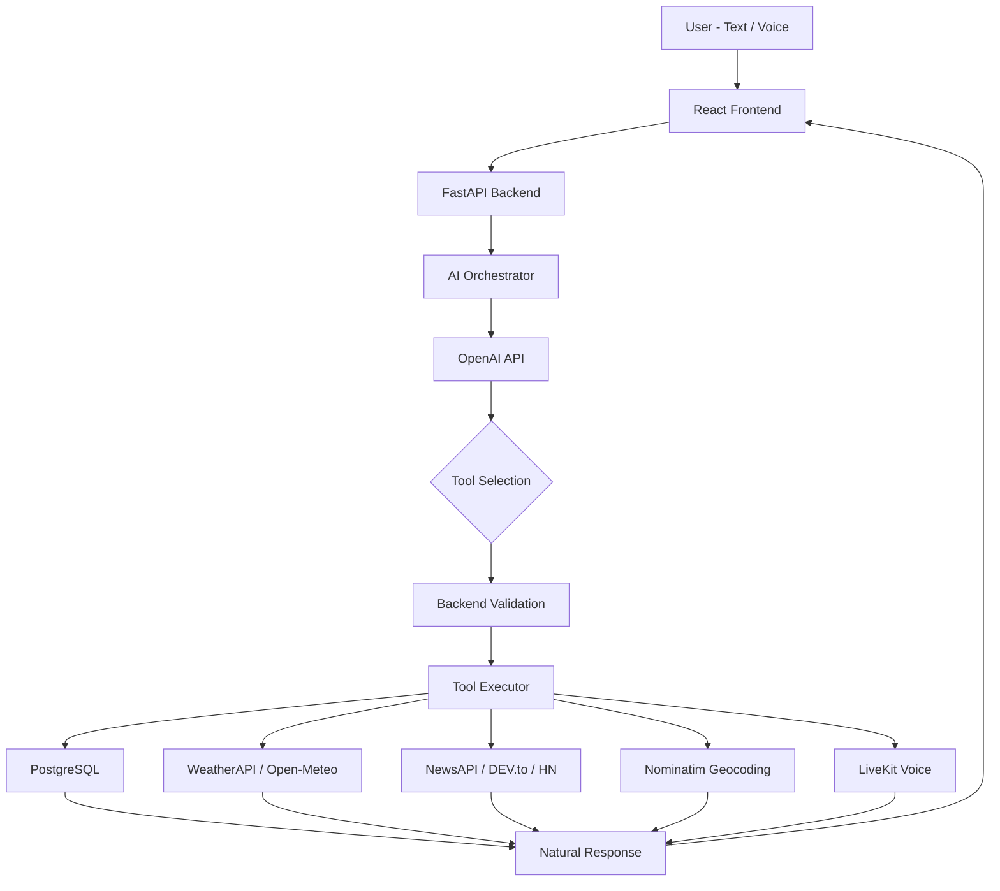

# TITAN Architecture

## System Flow



## Security Model

### Authentication Flow

1. User registers with email + password
2. Password hashed with `bcrypt.hashpw()` (direct, not passlib)
3. JWT token issued on login with configurable expiration
4. Every API request carries `Authorization: Bearer <token>` header
5. `get_current_user` dependency validates token and extracts user
6. Every database query filtered by `user_id` from the authenticated token

### Controlled Tool Execution

The LLM **never** has direct access to:
- Database queries
- Shell commands
- File system operations
- Network requests

Instead, the orchestrator:
1. Sends the user's message + conversation history to OpenAI
2. OpenAI returns `tool_calls` if action is needed
3. The executor validates each tool call against the 22 registered tools
4. Each tool function receives the authenticated `user_id` as a bound parameter
5. Results are returned to OpenAI for natural language synthesis
6. Multi-step loops allow chaining multiple tools in one request

## Database Schema

### Tables (9)

| Table | Purpose | Key Relationships |
|---|---|---|
| `users` | User accounts | Has many of everything below |
| `user_settings` | Preferences (timezone, theme, voice, custom prompt) | Belongs to user (1:1) |
| `conversations` | Chat sessions | Has many messages |
| `messages` | Individual chat messages | Belongs to conversation |
| `tasks` | Task management | Belongs to user |
| `reminders` | Scheduled alerts | Belongs to user |
| `notes` | Knowledge repository | Belongs to user |
| `memories` | Intentional long-term facts | Belongs to user (key-based upsert) |
| `activity_logs` | Audit trail | Belongs to user |

### Key Design Decisions

- **SQLAlchemy 2.0 async** — all queries use `AsyncSession` with `select()` style
- **Cascading deletes** — user deletion cascades to all owned entities
- **Indexed columns** — `user_id`, `status`, `priority`, `due_date`, `category`, `key`
- **Timestamps** — `created_at` and `updated_at` on every table with server defaults

## AI Tool System

### Tool Categories (22 Total)

**Tasks (6):** `create_task`, `list_tasks`, `get_task`, `update_task`, `complete_task`, `delete_task`

**Reminders (5):** `create_reminder`, `list_reminders`, `get_reminder`, `update_reminder`, `delete_reminder`

**Notes (5):** `create_note`, `search_notes`, `get_note`, `update_note`, `delete_note`

**Memory (3):** `save_memory`, `search_memory`, `delete_memory`

**Activity (2):** `get_activity`, `get_daily_summary`

**Information (3):** `get_weather`, `get_news`, `search_location`

**Conversations (2):** `get_conversation_history`, `search_conversations`

### Orchestration Loop

```python
# Simplified orchestrator flow
while True:
    response = await openai.chat.completions.create(
        model="gpt-4o",
        messages=conversation_history,
        tools=TOOL_DEFINITIONS,
    )

    if response.finish_reason == "tool_calls":
        for tool_call in response.tool_calls:
            result = await executor.execute(
                tool_name=tool_call.function.name,
                arguments=tool_call.function.arguments,
                user_id=authenticated_user.id,
                db=database_session,
            )
            conversation_history.append(tool_result_message)
    else:
        return response.content  # Natural language answer
```

## External Integrations

### Weather
- **Primary:** WeatherAPI (weatherapi.com) — current conditions + multi-day forecast
- **Fallback:** Open-Meteo (open-meteo.com) — free, no key required, WMO condition codes mapped to descriptions

### News
- **Primary:** NewsAPI (newsapi.org) — headlines by category and keyword search
- **Fallback:** DEV.to API + Hacker News Firebase API — live public tech/developer feeds

### Maps
- **Provider:** OpenStreetMap via Nominatim geocoding API
- **Frontend:** Leaflet.js interactive map with markers, popups, and zoom controls

### Voice
- **Primary:** LiveKit server-side agent (Python `livekit-agents`) for real-time audio streaming
- **Fallback:** Browser-native Web Speech API for recognition + SpeechSynthesis for playback

## Background Workers

### Reminder Scheduler
- Uses `apscheduler.AsyncIOScheduler` with `AsyncIOExecutor`
- Checks for due reminders every **15 seconds**
- Marks delivered reminders as `status='delivered'`
- Logs activity for each delivery

### Frontend Notification Poller
- `ToastContext` polls `/api/v1/reminders/notifications/poll` every **10 seconds**
- Displays browser-native toast notifications for due reminders
